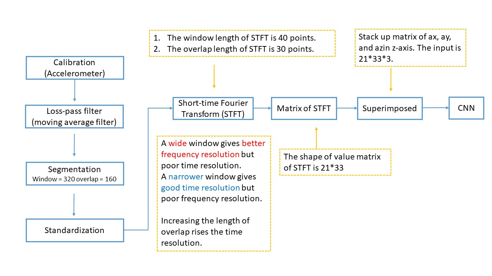
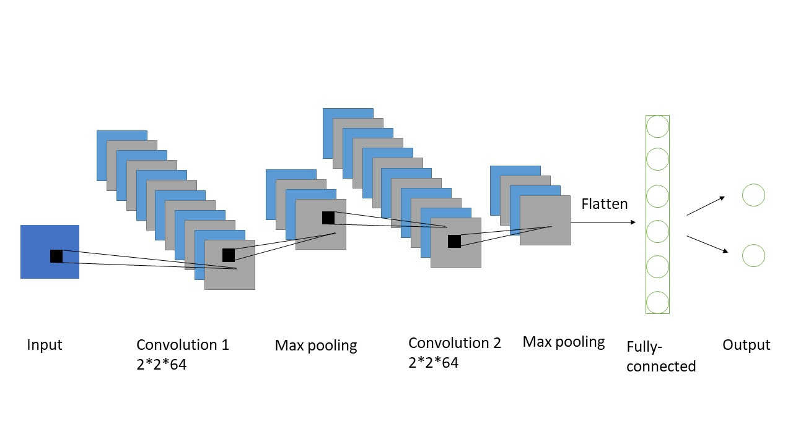
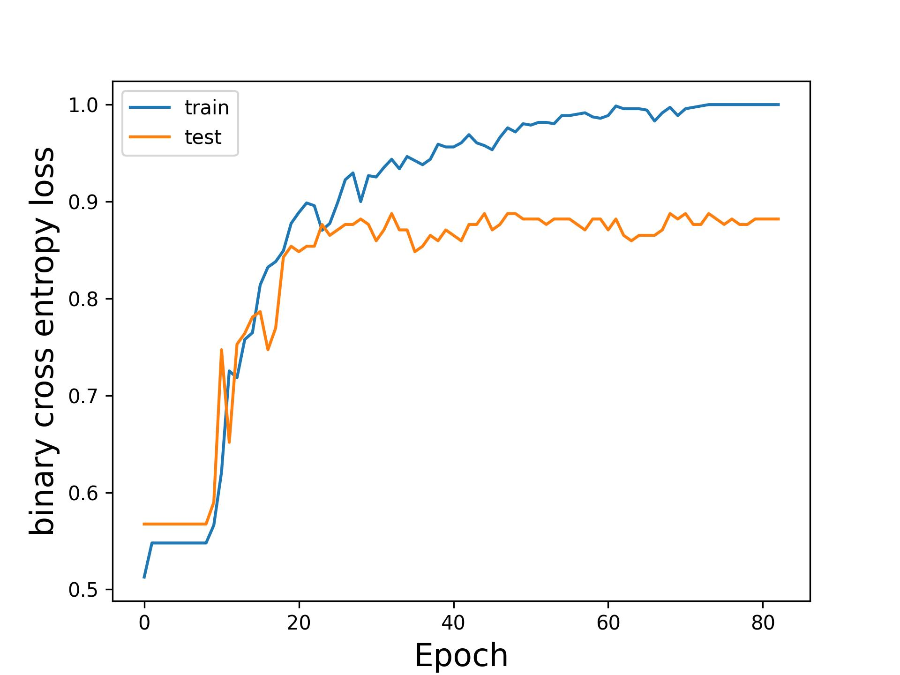
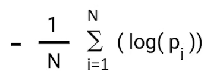
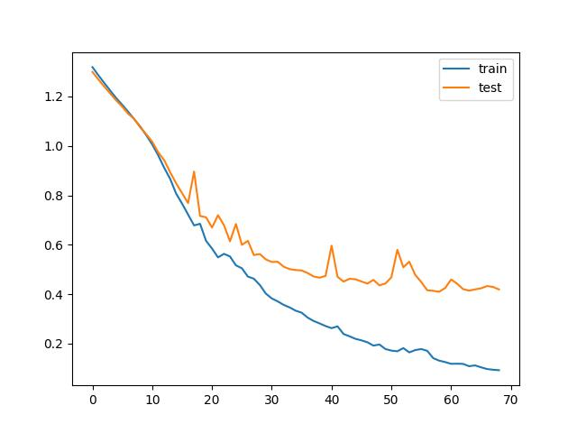

# Basketball

# An Example of CNN on IMU dataset

Detailes of the CNN strucdure is in the demo.


## Contents
* [Pre-requisite](#Requirements)
* [IMU dataset](#IMUdataset)
* [Preprocess flowchart](#Preprocess)
* [CNN structure](#CNNstructure)
* [Run the demo](#Run)
* [Results](#Results)
  * [Training/testing accuracy vs. epoch](#accuracy)
<!--   * [Training error vs. epoch](#Error) -->


<a name="Requirements">

## Pre-requisite
* Python 3.7
* Keras
* Tensorflow
* sklearn

<a name="Preprocess">

## Preprocess flowchart
The raw time-series data will be processed before inputting to CNN model.



<a name="IMUdataset">

## IMU dataset
In the IMU dataset, there are 888 shootings digit images for training and 223 for testing. The image size is 21x33xnumber of features, and the athletes are professional and rereational (binary categories). 


<a name="CNNstructure">

## CNN structure in the demo



<a name="Run">

## Run the demo

```
>> Mainfunction_basketball_2C
```

Note that 200 epochs will be performs. If you want to run more epochs, please modify the variable `num_epochs ` in the file [`Mainfunction_basketball_2C.py`](https://https://github.com/XiaoyuGuo-Kath/Basketball/edit/main/Mainfunction_basketball_2C.py) (line 111).

Note that input Ax, Az and Gy will be performs in this demo. If you want to run with different inputs, please modify the variable `allmatrix ` in the file [`Time2Freq.py`](https://https://github.com/XiaoyuGuo-Kath/Basketball/edit/main/Time2Freq.py) (line 272).

<a name="Results">

## Results
Running the demo for 200 epochs, the classification accuracy of inputs (AxAzGy) is shown as follow. Note that the results may be a little bit different for each running because of the random initialization of convolutional kernels.

| input | Testing loss | Testing accuracy |
| :---: | :---: | :---: |
| AxAzGy | 0.443 | 88.2% |


<a name="accuracy">

### Training and testing accuracy vs. epoch



<!-- <a name="Error">

### Training and testing error in binary_crossentropy 
The loss function used in this demo is 


 -->


